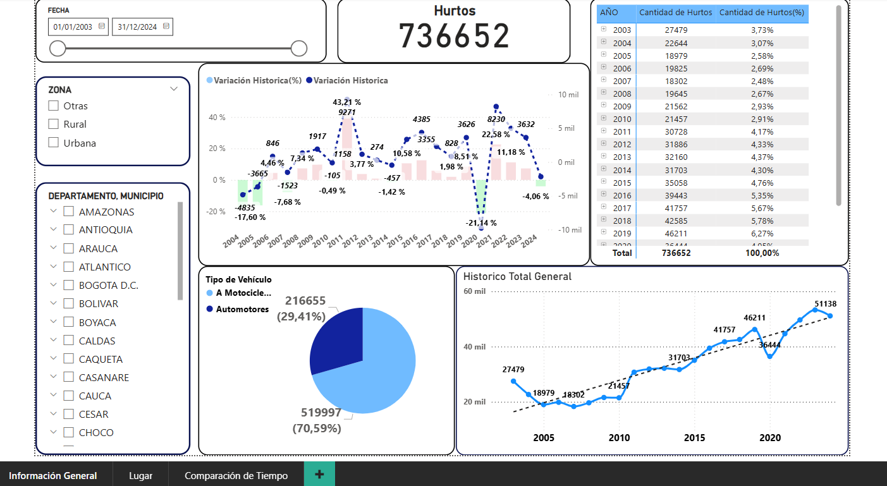
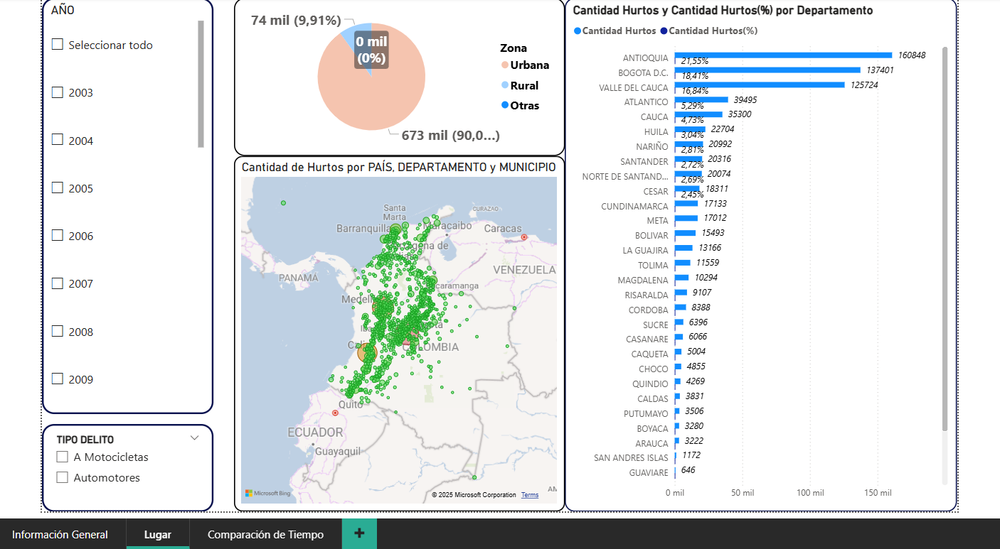
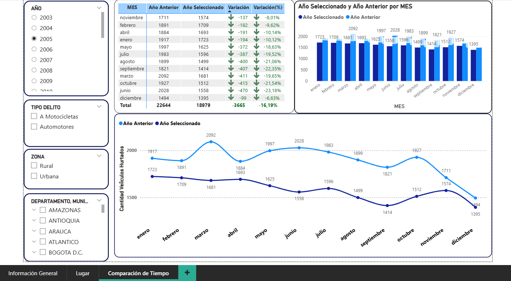

# Portafolio-Analisis-de-datos
Identificar tendencias espacio-temporales en hurtos en Colombia de vehículos (motocicletas/automotores) mediante el análisis de variables clave como ubicación geográfica (departamentos/municipios), contexto urbano/rural, y estacionalidad (tiempo).

## pagina 1:Informacion general
En esta página se pueden ver datos como la cantidad total de hurtos. Hay dos gráficas de líneas, una con los hurtos generales y otra con la variación. Hay una matriz para organizar datos de mayor cantidad a menor cantidad de hurtos o por orden de tiempo. Un gráfico de pastel para ver hurtos por tipo de vehículos, y la página se puede filtrar por fecha, Departamento/Municipio y Zona.

## pagina 2: Lugar
En esta página se pueden ver los datos de los hurtos por departamento y municipio. Hay un mapa y una gráfica de columnas apiladas donde se pueden ver los lugares con más robos y la representación en porcentaje del total de los robos. Se pueden filtrar por año y tipo de vehículo.

## pagina 3:Comparaciom de tiempo
En esta página se puede comparar entre dos años, el elegido y el anterior a ese. Se puede ver la información por las distintas jerarquías de tiempo: cuatrimestre, trimestre, meses, y en la gráfica de líneas se puede comparar por días. Se puede filtrar por zona, lugar y tipo de vehículo.

